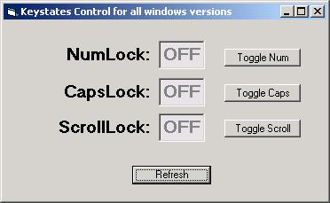



## Keystates for all windows versions

### Description

This program will allow you to examine and toggle the Caps, Scroll and Num Lock settings on all versions of windows.

I found several examples on PSC, but none that seemed to work on all versions so I put together the best of what I could find and after a little adapting I had what I believe to be some usefull code.
 
### More Info
 

             |
---                |---
**Submitted On**   |2003-05-27 11:49:06
**By**             |[Phobos](https://github.com/Planet-Source-Code/PSCIndex/blob/master/ByAuthor/phobos.md)
**Level**          |Intermediate
**User Rating**    |5.0 (15 globes from 3 users)
**Compatibility**  |VB 6\.0
**Category**       |[Windows API Call/ Explanation](https://github.com/Planet-Source-Code/PSCIndex/blob/master/ByCategory/windows-api-call-explanation__1-39.md)
**World**          |[Visual Basic](https://github.com/Planet-Source-Code/PSCIndex/blob/master/ByWorld/visual-basic.md)
**Archive File**   |[Keystates\_1592945272003\.zip](https://github.com/Planet-Source-Code/phobos-keystates-for-all-windows-versions__1-45756/archive/master.zip)

